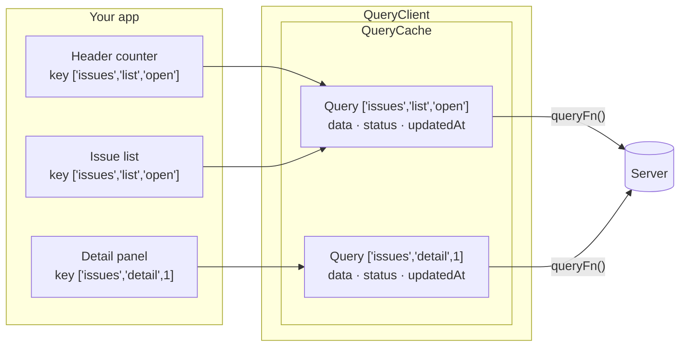

# Server state is not client state

<div style="display: flex; gap: 2em;">
<div>

### Client state

- **Owned** by the app: a theme, a draft, an open panel, a selected filter
- Always **up to date** — the app is the only writer
- **Synchronous**: read it, write it, done
- ➜ the framework's own state, or a store

</div>
<div>

### Server state

- **Borrowed**: the server owns it, the app holds a **copy**
- Goes **stale** the moment it arrives — another user, another tab, a cron
  job can change it
- **Asynchronous**: loading, error, retry, cancellation
- Needed by **several components**, at different times, with the same answer

</div>
</div>

<br />

> Most "state management" pain in a front-end is **server state kept in a client
> state tool**: a store full of `issues`, `issuesLoading`, `issuesError`,
> `issuesFetchedAt`… and the code that keeps them honest.

---

# Fetching by hand — what goes wrong

```ts
// The starter of workshop 01, in any framework: one component, three pieces of state
let issues: IssueSummary[] = [];
let loading = true;
let error: unknown = null;

async function load(filter: IssueFilter) {
  loading = true;
  try {
    issues = await fetchIssues(filter);
  } catch (e) {
    error = e;
  } finally {
    loading = false;
  }
}
```

<div style="display: flex; gap: 2em; font-size: 0.9em;">
<div>

- **Duplicates** — the header counter and the list both need the open issues:
  `GET /issues?status=open` **twice**
- **Races** — click *closed* then *open*: if *closed* answers last, the list
  shows the wrong filter
- **No cache** — come back to a filter: *Loading…* again, for data you had a
  second ago

</div>
<div>

- **Stale data** — another user closes an issue: nothing tells the screen
- **Loading flashes** — every refresh throws away what is on screen
- **No retry**, no cancellation, no refetch when the tab comes back
- And it is **repeated** in every component that fetches

</div>
</div>

---

# What TanStack Query is

<div style="display: flex; gap: 2em;">
<div>

### It is…

- An **async state manager**: a **cache** of server data, keyed by **query
  keys**
- A **synchroniser**: it decides **when** to refetch — on mount, on focus, on
  reconnect, on invalidation, on an interval
- **Framework-agnostic**: `@tanstack/query-core` holds all the logic; React,
  Angular, Vue, Solid, Svelte get a thin **adapter**

</div>
<div>

### It is not…

- A **fetching library** — it never makes an HTTP call. *You* give it a
  function that returns a promise: `fetch`, axios, a GraphQL client, a SDK, a
  fake server…
- A **client state store** — keep the theme and the draft where they are
- A **normalised cache** — data is stored **per key**, as the server returned it

</div>
</div>

<br />

```ts
import { QueryClient } from '@tanstack/query-core';

// One client per app — and one per test. A factory, so both get the same defaults.
export function createQueryClient(): QueryClient {
  return new QueryClient({ defaultOptions: { queries: { staleTime: 30_000 } } });
}
```

---

# The picture to keep in mind



- Components do not own the data: they **subscribe** to an entry of the cache
- Two components, **one key** → **one entry**, **one request**, the same answer
- The cache outlives the components: unmount, remount — the data is still there

---

# What you get for free

| Problem of the hand-rolled version | What the cache does |
|---|---|
| Two components, two requests | **Deduplication**: one request per key in flight |
| Slow answer overwrites a fast one | Results land in **their own key** — a late answer for *closed* never shows under *open* |
| *Loading…* every time | **Cached data first**, refetch in the background |
| Nobody knows the data changed | Refetch on **mount**, **window focus**, **reconnect**, **invalidation** |
| No retry | **3 retries** with exponential backoff, by default |
| Flash of empty content on refresh | Data **kept** during a refetch; `placeholderData` between keys |
| Copy-pasted `loading/error/data` | One **state machine** per query, read through the adapter |

<br />

> The adapter's query function — `useQuery` in React and Vue, `injectQuery` in
> Angular — is only a **subscription** to that cache. Everything on this slide
> lives in `query-core`, the same for the three frameworks.

<style>
table { font-size: 0.85em; }
</style>
