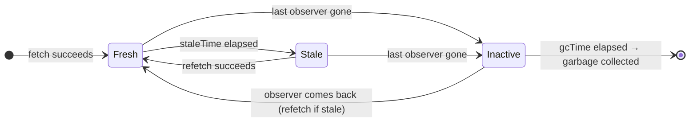

# The life of a cache entry



- **Fresh** — trusted: served from the cache, **no request** on mount, focus or
  reconnect
- **Stale** — still served **at once**, but **refetched in the background** at
  the next trigger (mount, focus, reconnect, invalidation)
- **Inactive** — no component uses it anymore; the data stays, a **gc timer**
  starts
- **Garbage collected** — removed from memory; the next reader starts from
  `pending`

---

# `staleTime` vs `gcTime`

| | `staleTime` | `gcTime` |
|---|---|---|
| Question it answers | **How long do I trust the data** without asking the server? | **How long do I keep data nobody uses** in memory? |
| Default | **`0`** — stale immediately | **5 minutes** (`5 * 60 * 1000`) |
| Clock starts | when the data is **fetched** (`dataUpdatedAt`) | when the **last observer unsubscribes** |
| When it runs out | the next trigger **refetches** — data still shown | the entry is **deleted** |
| Special values | `Infinity`, `'static'` (never stale, not even on invalidation), a function `(query) => number` | `Infinity` = never collected |
| Per | observer (the **shortest** wins at fetch time) | query (the **longest** wins) |

<br />

> **Stale is not evicted.** A stale query is still in the cache and still on
> screen. Only `gcTime` removes data — and only data **nobody is using**.

<style>
table { font-size: 0.8em; }
</style>

---

# `cacheTime` is now `gcTime`

The programme says *"staleTime vs cacheTime"* — that is the v4 vocabulary.

```ts
// v4
new QueryClient({ defaultOptions: { queries: { staleTime: 30_000, cacheTime: 10 * 60_000 } } });

// v5 — same behaviour, new name
new QueryClient({ defaultOptions: { queries: { staleTime: 30_000, gcTime: 10 * 60_000 } } });
```

- Same meaning: how long an **unused** entry survives. Renamed because
  "cache time" made everyone believe it was **how long the data is cached** —
  i.e. what `staleTime` actually controls
- Mutations have a `gcTime` too (5 min): how long a finished mutation stays in
  the `MutationCache` — visible in the devtools, readable by the mutation state
- On the server (SSR), the default `gcTime` is `Infinity` and `retry` is `0`

---

# One scenario, three outcomes

`issuesQuery('closed')` with `staleTime: 30_000` and the default `gcTime` (5 min).
The user opens the *closed* filter, goes back to *open*, then:

| Comes back to *closed*… | Entry state | What the user sees | Request? |
|---|---|---|---|
| after **10 s** | fresh, inactive | the cached list, at once | **none** |
| after **2 min** | stale, inactive | the cached list, at once — then the refreshed one | **one, in the background** (`isFetching`, not `isPending`) |
| after **6 min** | garbage collected | the skeleton, then the list | **one** (`isPending`) |

<br />

- With the default **`staleTime: 0`**, the first row also refetches — every
  mount, every focus. That is why a default setup "does too many requests"
- `staleTime` is the **first knob** to turn: decide it, per app and per query

<style>
table { font-size: 0.85em; }
</style>

---

# Choosing values per kind of data

| Data | `staleTime` | Why |
|---|---|---|
| Reference data: countries, currencies, feature flags | `Infinity` / `'static'` | Changes with a deployment, not during a session |
| The current user, permissions | 5–15 min | Rarely changes; invalidate on login / logout |
| A list others edit (issues) | 10–60 s | A short trust window removes duplicate fetches on navigation |
| A detail being edited by others, a dashboard | 0 + `refetchOnWindowFocus` / `refetchInterval` | Must reflect others' changes |
| Data **you** change | anything — **invalidate** after your own writes | Your writes do not need the clock |

```ts
new QueryClient({
  defaultOptions: { queries: { staleTime: 30_000 } },   // the app's default
});

queryOptions({ queryKey: ['countries'], queryFn: fetchCountries, staleTime: Infinity, gcTime: Infinity });
```

- Raising `gcTime` keeps more in **memory** — rarely a problem, but think of
  many large entries (chapter 08)
- Keep `gcTime` **≥** `staleTime` in practice: fresh data that has already been
  collected is no use

<style>
table { font-size: 0.8em; }
</style>

---

# Seeing it in the devtools

- Each entry shows a coloured status: **fresh** (green), **fetching** (blue),
  **paused** (purple), **stale** (yellow), **inactive** (grey)
- The **observers** count: `0` means inactive — the gc timer is running
- **Last updated**: the `dataUpdatedAt` the `staleTime` is measured from
- Leave a filter, watch the entry go **grey**; with a short `gcTime`, watch it
  **disappear**

```ts
// A debugging-only setup to make the lifecycle visible during the workshop
new QueryClient({ defaultOptions: { queries: { staleTime: 5_000, gcTime: 15_000 } } });
```

> Workshop 02, step 1: `staleTime: 30_000` in `defaultOptions` — coming back to
> a filter must send **nothing** in the Network panel.
