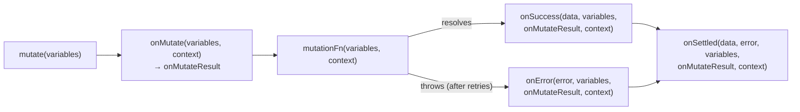

# The lifecycle of a mutation



- **`onMutate`** — before the request: prepare, snapshot, write optimistically.
  What it **returns** is handed to the three others as `onMutateResult`
- **`onSuccess`** / **`onError`** — one or the other
- **`onSettled`** — always, like `finally`
- Every callback may return a **promise**: it is **awaited** before the next
  step — and the mutation stays `pending` meanwhile

---

# The signatures, in 5.104

```ts
{
  onMutate:  (variables, context) => onMutateResult | Promise<onMutateResult>,
  onSuccess: (data, variables, onMutateResult, context) => unknown,
  onError:   (error, variables, onMutateResult | undefined, context) => unknown,
  onSettled: (data | undefined, error | null, variables, onMutateResult | undefined, context) => unknown,
}

// context: MutationFunctionContext
{ client: QueryClient; meta: MutationMeta | undefined; mutationKey?: MutationKey }
```

- **Renamed during v5**: what `onMutate` returns used to be called *context*;
  it is now **`onMutateResult`**, and the **last** parameter `context` gives the
  `QueryClient` — no closure over the client needed
- `onMutateResult` is `undefined` in `onError` / `onSettled` if **`onMutate`
  itself** threw
- Older v5 code: `onError: (error, variables, context) => …` where `context` is
  today's `onMutateResult` — same position, new name

---

# Two places for callbacks

```ts
// 1. In the mutation's options — the adapter's mutation function receives them
const options = {
  mutationFn: createIssue,
  onSuccess: () => queryClient.invalidateQueries({ queryKey: issueKeys.all }),   // cache logic
};

// 2. In the call
mutate({ title }, {
  onSuccess: () => clearInput(),                 // UI logic
  onError: (error) => showError(error.message),
});
```

Order for one call: **options-level first**, then **mutate-level**:

```text
onMutate → mutationFn → options.onSuccess → options.onSettled → mutate.onSuccess → mutate.onSettled
```

(and `MutationCache` callbacks, if any, before each options-level one — see
mutation state)

---

# Which callback for what

<div style="display: flex; gap: 2em;">
<div>

### Options-level — **always** run

- Run even if the component that called `mutate` is **gone** (dialog closed,
  route changed)
- ➜ **cache logic**: invalidation, `setQueryData`, rollback
- Defined **once**, with the mutation — every caller benefits

</div>
<div>

### `mutate()`-level — **may be skipped**

- Run **only** if the observer is still mounted when the mutation settles
- Run only for the **last** `mutate()` call of that observer
- ➜ **UI logic**: clear the input, close a dialog, navigate, a toast tied to
  this screen

</div>
</div>

<br />

> Workshop 04, step 2: clear `new-title` in the **mutate-level** `onSuccess`
> only — with *"The server refuses every write"* on, the input must **keep**
> what was typed, and `create-error` shows `error.message`.

---

# Returning the promise from `onSuccess`

```ts
onSuccess: () => queryClient.invalidateQueries({ queryKey: issueKeys.all }),   // returned ✅
// vs
onSuccess: () => { queryClient.invalidateQueries({ queryKey: issueKeys.all }); },   // dropped
```

<div style="display: flex; gap: 2em;">
<div>

### Returned

```text
POST 400 ms ─▶ refetch GET 400 ms ─▶ settled
isPending:  true ─────────────────▶ false
```

- The mutation is `pending` until the **new list** is in the cache
- The button re-enables when the new issue is **visible**
- Mutate-level `onSuccess` (clear the input) runs **after** the refetch

</div>
<div>

### Not returned

```text
POST 400 ms ─▶ settled
               refetch GET 400 ms ─▶ list updated
```

- `isPending` turns `false` while the list still shows the **old** data
- A 400 ms window where the form says "done" but the issue is missing

</div>
</div>

<br />

- Return it when the user should wait for the **fresh** data; don't when the
  screen is already right (optimistic updates — chapter 05)

---

# Callback traps

- **Arrow function braces** swallow the promise: `() => { invalidate() }`
  returns `undefined` — write `() => invalidate()` or `async () => { await … }`
- **Throwing inside `onSuccess`** turns the mutation into an **error** — and
  `onError` runs
- **`mutate` in a loop** with mutate-level callbacks: only the **last** call's
  callbacks fire — use options-level callbacks, or `mutateAsync` + `Promise.all`
- **Closing over state** in options-level callbacks: they see the values of
  the render that created the mutation — read what you need from `variables`
  or the cache instead
- **Navigating away in `onSuccess`** before the invalidation resolves: fine —
  the options-level callbacks still run, the cache stays consistent
