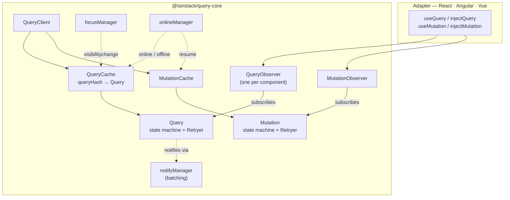

# The architecture



---

# Who does what

| Piece | Responsibility |
|---|---|
| **`QueryClient`** | The public API: `invalidateQueries`, `setQueryData`, defaults… It **holds** the two caches and wires the focus / online managers to them |
| **`QueryCache`** | A `Map` from **`queryHash`** to `Query`; builds or finds a query (`build`), finds by filters, emits events (`added`, `updated`, `removed`…) |
| **`Query`** | One entry: its **state** (`data`, `status`, `fetchStatus`, `dataUpdatedAt`, `error`…), its options, its **observers**, the **in-flight promise**, the **gc timer** |
| **`Retryer`** | Runs the query / mutation function: retries, delays, pause when offline or hidden, cancellation |
| **`QueryObserver`** | The link between **one** consumer and **one** query: computes the **result** (`isPending`, `isFetching`, `select`ed data, placeholder), decides when to fetch (mount, stale timer, interval), notifies only on **relevant** changes |
| **`MutationCache` / `Mutation` / `MutationObserver`** | The same trio for writes — no key-based sharing: one `Mutation` per `mutate()` |
| **`notifyManager`** | **Batches** notifications: many cache updates in one tick → one render |
| **`focusManager` / `onlineManager`** | Global singletons: tell the caches when to refetch / resume |

<style>
table { font-size: 0.75em; }
</style>

---

# The adapter is thin

<div style="display: flex; gap: 2em;">
<div>

### In `query-core` (shared)

- Caching, hashing, deduplication
- Staleness, garbage collection
- Retries, cancellation, offline
- Refetch triggers, polling
- Structural sharing, `select`
- Mutations and their callbacks
- Hydration

</div>
<div>

### In the adapter (per framework)

- Get the `QueryClient` from the framework's **DI** (context, `inject`,
  `provide`)
- Create a **`QueryObserver`** per component, with the options
- **Subscribe** it, turn its result into the framework's reactivity (React
  state, a Vue `ref`, an Angular `signal`)
- **Unsubscribe** on unmount / destroy
- Re-apply options when inputs change
- Framework extras: Suspense, devtools wiring

</div>
</div>

<br />

> That is why everything in these slides works the same in React, Angular and
> Vue — and why the same mental model transfers to Solid or Svelte.

---

# Watching the internals

```ts
// Every event of the query cache — a poor man's devtools
queryClient.getQueryCache().subscribe((event) => {
  console.log(event.type, event.query.queryHash, event.query.state.fetchStatus);
});
// added      ["issues","list","open"]  fetching
// observerAdded ["issues","list","open"] fetching
// updated    ["issues","list","open"]  idle        ← action: success
// observerRemoved …
// removed    ["issues","list","closed"] idle       ← garbage collected

const query = queryClient.getQueryCache().find({ queryKey: issueKeys.list('open') });
query?.getObserversCount();     // how many components use it
query?.isStale();
query?.state.dataUpdateCount;   // how many times its data changed
```

- Useful for logging, analytics ("which queries are slow?"), custom tooling
- The devtools are built on exactly these events
