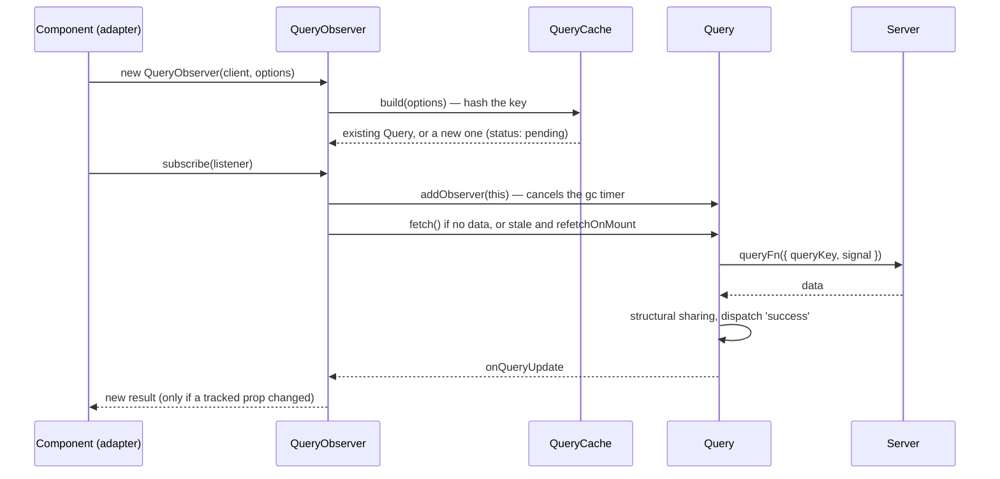

# A component asks for `['issues', 'list', 'open']`



---

# Step by step

1. **Hash** — `hashKey(queryKey)` → `'["issues","list","open"]'` (or your
   `queryKeyHashFn`)
2. **Build or find** — `QueryCache.build` looks the hash up; missing → a new
   `Query` with `status: 'pending'` (or `initialData`), event `added`
3. **Observe** — the adapter's `QueryObserver` computes an **optimistic
   result** right away (cached data, placeholder…) so the first render is
   correct
4. **Subscribe** — `addObserver`: the query is now **active**; its gc timer, if
   any, is **cleared**
5. **Fetch?** — `shouldFetchOnMount`: no data, or stale and `refetchOnMount`,
   and `enabled` → `query.fetch()`
6. **Deduplicate** — a fetch already in flight? `fetch()` returns **the same
   promise**; no second call to the query function
7. **Resolve** — the `Retryer` runs the function (retries, pauses); on success
   the query dispatches `success`: new `data`, `dataUpdatedAt = now`,
   `fetchStatus: 'idle'`
8. **Notify** — every observer recomputes its result; `notifyManager` batches
   the listeners into one flush

---

# The timers

<div style="display: flex; gap: 2em;">
<div>

### Stale timer — per observer

- After a success, the observer schedules a timeout of `staleTime`
- When it fires, the result's `isStale` flips to `true` and the observer
  notifies (if `isStale` is tracked)
- **No fetch happens then**: staleness only makes the **next trigger** refetch
- `staleTime: Infinity` / `'static'` → no timer

### Interval timer — per observer

- `refetchInterval`: a `setInterval`, paused when the tab is hidden (unless
  `refetchIntervalInBackground`)

</div>
<div>

### GC timer — per query

- Scheduled when the **last observer unsubscribes** (and when a query is
  created without one — a prefetch)
- After `gcTime`: if still no observer, `QueryCache.remove(query)` → event
  `removed`, the data is gone
- A new observer before that: the timer is **cleared**, the data reused
- The **longest** `gcTime` among the options seen by the query wins

</div>
</div>

<br />

> All timers go through `timeoutManager`, which can be swapped — e.g. for very
> long `gcTime`s (above `setTimeout`'s ~24.8-day limit) or custom schedulers.

---

# Structural sharing

When new data arrives, the query does **not** just replace the old value:

```ts
import { replaceEqualDeep } from '@tanstack/query-core';

const before = [{ id: 1, title: 'A' }, { id: 2, title: 'B' }];
const after  = [{ id: 1, title: 'A' }, { id: 2, title: 'B (renamed)' }];   // fresh JSON

const result = replaceEqualDeep(before, after);
result === before;           // false — something changed
result[0] === before[0];     // TRUE  — issue 1 is deep-equal: the OLD reference is kept
result[1] === before[1];     // false — issue 2 changed: a new object
```

- A refetch that returns **identical** JSON yields the **same** reference →
  observers see no change → **no re-render** at all
- A partial change keeps the references of what did not change → memoised
  children (`React.memo`, `computed`, `OnPush`) skip work
- Applied to `data` **and** to the result of `select`
- Only for **JSON-compatible** values (plain objects and arrays) — class
  instances, `Map`s are replaced as is

---

# The same lifecycle for a mutation

```text
mutate(vars) ─▶ MutationObserver.mutate ─▶ MutationCache.build ─▶ new Mutation (one per call)
                                                                        │
  scope queue? network? ─▶ paused ─────────────────────────────────────┤
                                                                        ▼
  MutationCache.onMutate ─▶ options.onMutate ─▶ Retryer(mutationFn) ─▶ success | error
                                                                        │
  cache.onSuccess|onError ─▶ options.onSuccess|onError ─▶ cache.onSettled ─▶ options.onSettled
                                                                        │
  dispatch 'success' | 'error' ─▶ observer ─▶ mutate()-level callbacks (if still subscribed)
                                                                        │
  no observer left ─▶ gc timer (gcTime, 5 min) ─▶ removed from the MutationCache
```

- A `Mutation` is **never** shared or deduplicated — the cache is only a
  registry, for `isMutating`, mutation state, devtools and persistence
- `isPending` stays `true` until every awaited callback has resolved
