# Part 8: Data Retention and ILM

---

# Retention Strategies

<v-clicks>

| Strategy | Resources | Access | Use Case |
|----------|-----------|--------|----------|
| Open index | CPU + RAM + Disk | Real-time | Active data |
| Closed index | Disk only | Reopening needed | Short-term archives |
| Shrinked index | Fewer shards | Real-time (read) | Reduce overhead |
| Snapshot | External storage | Restoration | Backup/archives |
| Deletion | None | None | Expired data |

</v-clicks>

---

# Open/Close API

```bash
# Close an index (frees RAM/CPU)
POST /logs-2025.01.01/_close

# Verify
GET /_cat/indices/logs-*?v&h=index,status

# Reopen
POST /logs-2025.01.01/_open
```

<v-clicks>

**Benefits**:
- Immediately frees memory
- Data still on disk
- Fast reopening

</v-clicks>

---

# Shrink API

Reduce the number of shards:

```bash
# Prepare the index (read-only)
PUT /logs-old/_settings
{
  "settings": {
    "index.blocks.write": true
  }
}

# Shrink from 4 shards to 1
POST /logs-old/_shrink/logs-shrunk
{
  "settings": {
    "index.number_of_shards": 1
  }
}
```

<v-click>

> Shrink = fewer shards = less heap

</v-click>

---

# Data Streams

Perfect for your logs:

```
Data Stream: logs-parkki
├── .ds-logs-parkki-2025.01.13-000001 (read)
├── .ds-logs-parkki-2025.01.14-000002 (read)
└── .ds-logs-parkki-2025.01.15-000003 (write)
```

<v-clicks>

**Benefits**:
- Automatic rollover
- Unique name (no more manual management)
- Easy deletion of old indices
- Transparent search

</v-clicks>

---

# Index Lifecycle Management (ILM)

Automate index management through lifecycle phases:

```mermaid
flowchart LR
    subgraph HOT["🔥 HOT"]
        H1[Active indexing]
        H2[Frequent searches]
        H3[Fast SSDs]
    end
    subgraph WARM["🌡️ WARM"]
        W1[Read-only]
        W2[Shrink shards]
        W3[Force merge]
    end
    subgraph COLD["❄️ COLD"]
        C1[Rare searches]
        C2[Fewer replicas]
        C3[HDDs OK]
    end
    subgraph DELETE["🗑️ DELETE"]
        D1[Permanent removal]
    end
    HOT -->|min_age: 2d| WARM
    WARM -->|min_age: 7d| COLD
    COLD -->|min_age: 30d| DELETE
```



---

# ILM Phases Overview

| Phase | Resources | Access | Typical Actions |
|-------|-----------|--------|-----------------|
| 🔥 **Hot** | High (SSD + RAM) | Read/Write | Rollover, set priority |
| 🌡️ **Warm** | Medium | Read-only | Shrink, force merge, relocate |
| ❄️ **Cold** | Low (HDD) | Rare reads | Reduce replicas, searchable snapshot |
| 🧊 **Frozen** | Minimal | Very rare | Mounted snapshot |
| 🗑️ **Delete** | None | None | Permanent deletion |

---

# ILM Policy for Parkki

```json
PUT /_ilm/policy/logs-parkki-policy
{
  "policy": {
    "phases": {
      "hot": {
        "actions": {
          "rollover": {
            "max_age": "1d",
            "max_primary_shard_size": "20gb"
          }
        }
      },
      "warm": {
        "min_age": "2d",
        "actions": {
          "readonly": {},
          "forcemerge": { "max_num_segments": 1 }
        }
      },
      "delete": {
        "min_age": "10d",
        "actions": { "delete": {} }
      }
    }
  }
}
```

---

# ILM Timeline for Parkki

<v-clicks>

| Day | Phase | Actions |
|-----|-------|---------|
| 0-1 | Hot | Active indexing |
| 1 | Hot | Rollover (new backing index) |
| 2 | Warm | readonly, forcemerge |
| 10 | Delete | Automatic deletion |

</v-clicks>

<br>

<v-click>

**Estimated savings**:

```
Without ILM: 150 GB hot → RAM 5 GB
With ILM: 30 GB hot + 120 GB warm → RAM 1.75 GB

Reduction: -65% RAM!
```

</v-click>

---

# Associate ILM with a Template

```json
PUT /_index_template/logs-parkki-template
{
  "index_patterns": ["logs-parkki-*"],
  "data_stream": {},
  "template": {
    "settings": {
      "number_of_shards": 1,
      "number_of_replicas": 1,
      "refresh_interval": "30s",
      "index.lifecycle.name": "logs-parkki-policy"
    }
  }
}
```

<v-click>

> Each new index automatically inherits the ILM policy

</v-click>

---

# ILM Monitoring

```bash
# Global ILM status
GET /_ilm/status

# Indices managed by ILM
GET /*/_ilm/explain?only_managed=true

# Indices with errors
GET /*/_ilm/explain?only_errors=true

# Retry after error
POST /logs-parkki/_ilm/retry
```
