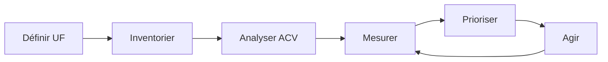

# Démarche d'écoconception

## Méthodologie et piliers fondamentaux

---

# Qu'est-ce que l'écoconception ?

## Définition officielle

**Selon la norme ISO 14062:**

> L'écoconception est l'intégration des aspects environnementaux dans la conception et le développement de produits et services, avec pour objectif la réduction des impacts environnementaux négatifs tout au long de leur cycle de vie.

**Appliqué aux services numériques:**
- 🎯 Minimiser les ressources nécessaires (CPU, RAM, stockage, bande passante)
- ⚡ Optimiser les performances (temps de chargement, réactivité)
- 📱 Allonger la durée de vie des équipements utilisateurs
- 🔋 Réduire la consommation énergétique globale
- ♻️ Faciliter la maintenance et l'évolution
- 🌍 Réduire l'empreinte carbone sur tout le cycle de vie

**Principe fondamental:** Penser "sobre par défaut"

---

# Les 5 piliers de l'écoconception

## Méthodologie structurée

**1️⃣ UNITÉ**

fonctionnelle

**2️⃣ INVENTAIRE**

des équipements

**3️⃣ CYCLE**

de vie

**4️⃣ INDICATEURS**

environnementaux

**5️⃣ PRIORISATION**

des actions

---

# Pilier 1: Unité fonctionnelle

## Définir le périmètre

**Qu'est-ce qu'une unité fonctionnelle ?**
> La quantification d'une fonction ou d'un service rendu permettant de comparer différentes solutions

**Exemples:**
- "Permettre à un utilisateur de consulter son compte bancaire"
- "Visionner 1h de vidéo en streaming"
- "Envoyer un email avec pièce jointe de 5 Mo"

**Pourquoi c'est important ?**
- Compare des solutions sur une base équivalente
- Évite les fausses bonnes solutions
- Permet des mesures objectives

---

# Pilier 2: Inventaire des équipements

## Cartographier le système

**Identifier tous les équipements du service:**

**Côté utilisateur:**
- Smartphones, tablettes
- Ordinateurs (desktop, laptop)
- TV connectées, consoles
- Objets connectés (IoT)

**Côté infrastructure:**
- Serveurs (web, application, base de données)
- Équipements réseau (routeurs, switches)
- Systèmes de stockage
- CDN (Content Delivery Network)

---

# Pilier 3: Cycle de vie

## Analyser toutes les phases

**Les 5 étapes du cycle de vie:**

1. **Extraction** des matières premières
2. **Fabrication** des composants et assemblage
3. **Distribution** et transport
4. **Utilisation** du service
5. **Fin de vie** (recyclage, élimination)

**Principe:** Prendre en compte TOUTES les phases, pas seulement l'utilisation

---

# Pilier 4: Indicateurs environnementaux

## Mesurer de manière multicritère

**Indicateurs clés:**

| Indicateur | Unité | Description |
|------------|-------|-------------|
| **Émissions GES** | kg CO₂eq | Contribution au réchauffement climatique |
| **Énergie primaire** | MJ | Consommation énergétique totale |
| **Eau** | L | Consommation d'eau douce |
| **Ressources abiotiques** | kg Sb eq | Épuisement des ressources minérales |

**Attention:** Une évaluation doit être **multicritère** pour éviter les transferts d'impacts

---

# Pilier 5: Priorisation

## Identifier les actions prioritaires

**Méthode:**

1. **Analyser** les résultats multicritères
2. **Identifier** les points chauds (hotspots)
3. **Prioriser** selon:
   - Impact environnemental
   - Faisabilité technique
   - Coût / bénéfice
4. **Planifier** les actions
5. **Mesurer** les résultats

**Principe 80/20:** Se concentrer sur les 20% d'actions qui apportent 80% des bénéfices

---

# La démarche en pratique

## Processus itératif

**C'est un processus d'amélioration continue !**

---

# Écoconception vs Optimisation

## Deux approches complémentaires

**Optimisation (Green IT):**
- Améliorer l'existant
- Réduire la consommation
- Optimiser les performances

**Écoconception:**
- Intégrer dès la conception
- Questionner le besoin
- Concevoir sobre par défaut

**L'écoconception commence AVANT le projet, pas après !**

---

# Les 3 niveaux d'action

## Du produit au système

**Niveau 1**

**PRODUIT**

Optimiser un service existant

**Niveau 2**

**SERVICE**

Repenser le service dans son ensemble

**Niveau 3**

**SYSTÈME**

Questionner le besoin et proposer des alternatives

**Exemple:**
- Niveau 1: Optimiser un site e-commerce
- Niveau 2: Repenser l'expérience d'achat en ligne
- Niveau 3: Favoriser le commerce local de proximité

---

# Questionner le besoin

## La fonctionnalité est-elle nécessaire ?

**Questions à se poser:**

- Cette fonctionnalité répond-elle à un vrai besoin utilisateur ?
- Quel est son taux d'utilisation réel ?
- Existe-t-il une alternative plus sobre ?
- Peut-on simplifier ou fusionner avec une autre fonctionnalité ?

**Exemple concret:**
- Suppression des fonctionnalités < 5% d'usage
- Simplification des parcours utilisateurs
- Réduction du nombre d'écrans

**La meilleure ligne de code est celle qu'on n'écrit pas !**

---

# L'approche "Mobile First"

## Penser sobre dès le départ

**Principe:**
> Concevoir d'abord pour mobile, puis adapter pour desktop

**Avantages pour l'écoconception:**
- Force la priorisation des contenus
- Limite la complexité
- Réduit le poids des pages
- Optimise les performances

**Attention:** Mobile First ≠ Mobile Only

---

# Accessibilité et écoconception

## Des démarches convergentes

**Points communs:**

- **Simplification** de l'interface
- **Clarté** des contenus
- **Performance** technique
- **Compatibilité** large
- **Robustesse** du code

**Un site accessible est souvent plus sobre !**

**Bonus:** Conformité RGAA (Référentiel Général d'Amélioration de l'Accessibilité)

---

# Les freins à l'écoconception

## Obstacles courants

**Organisationnels:**
- Manque de sensibilisation
- Priorité aux fonctionnalités
- Pas de budget dédié
- Pas de mesure d'impact

**Techniques:**
- Frameworks lourds imposés
- Legacy complexe
- Dépendances externes
- Manque de compétences

**Comment les surmonter ?** Formation, sensibilisation, accompagnement

---

# Les bénéfices de l'écoconception

## Au-delà de l'environnement

**Environnementaux:**
- ✅ Réduction des impacts
- ✅ Allongement de la durée de vie des équipements

**Économiques:**
- ✅ Réduction des coûts d'hébergement
- ✅ Moins de maintenance
- ✅ Moins de support technique

**Utilisateurs:**
- ✅ Performances améliorées
- ✅ Meilleure accessibilité
- ✅ Expérience simplifiée

**Techniques:**
- ✅ Code plus maintenable
- ✅ Dette technique réduite
- ✅ Agilité accrue

---

# Les étapes d'un projet écoconçu

## Intégration dans le cycle projet

**1. Cadrage:**
- Définir l'unité fonctionnelle
- Identifier les parties prenantes
- Fixer des objectifs environnementaux

**2. Conception:**
- Questionner les besoins
- Prioriser les fonctionnalités
- Concevoir sobre

**3. Développement:**
- Appliquer les bonnes pratiques
- Mesurer en continu
- Optimiser

**4. Exploitation:**
- Monitorer les impacts
- Améliorer continuellement
- Sensibiliser les utilisateurs

---

# Gouvernance et pilotage

## Intégrer l'écoconception dans l'organisation

**Rôles et responsabilités:**

- **Product Owner:** Priorisation des fonctionnalités
- **UX/UI Designer:** Conception sobre
- **Développeurs:** Bonnes pratiques techniques
- **DevOps:** Infrastructure optimisée
- **Référent Green IT:** Animation et suivi

**Indicateurs de suivi:**
- Score EcoIndex
- Poids des pages
- Nombre de requêtes
- Temps de chargement

---

# En résumé

**Les points clés de la démarche d'écoconception:**

- Démarche structurée en 5 piliers
- Approche multicritère sur tout le cycle de vie
- Intégration dès la conception, pas après
- Questionner le besoin avant de développer
- Processus d'amélioration continue
- Bénéfices environnementaux, économiques et techniques

**Prochaine étape:** Comment appliquer concrètement avec le RGESN et les bonnes pratiques

---
layout: cover
---

# Le RGESN en détail

## Référentiel Général d'Écoconception de Services Numériques
